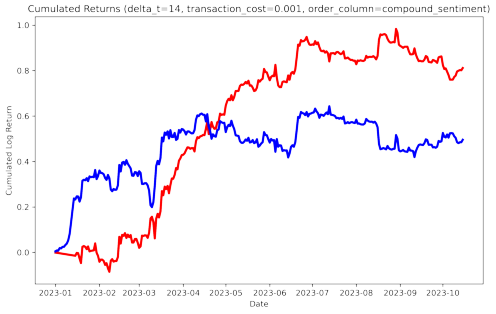

[](http://quantlet.de/)

## [](http://quantlet.de/) **Trading Strategy** [](http://quantlet.de/)

```yaml

Name of QuantLet : Trading Strategy

Published in : IDA

Description : 'Trading strategy for Bitcoin, using different sentiment-based features.'

Keywords : 'Facebook, sentiment analysis, Bitcoin, trading strategy'

Author: Daniel Traian Pele

Submitted : Mon, 04 December 2023
Input: 'btc_sentiment_predictions.csv'

```



### [IPYNB Code: Trading strategy.ipynb](Trading strategy.ipynb)


automatically created on 2023-12-05